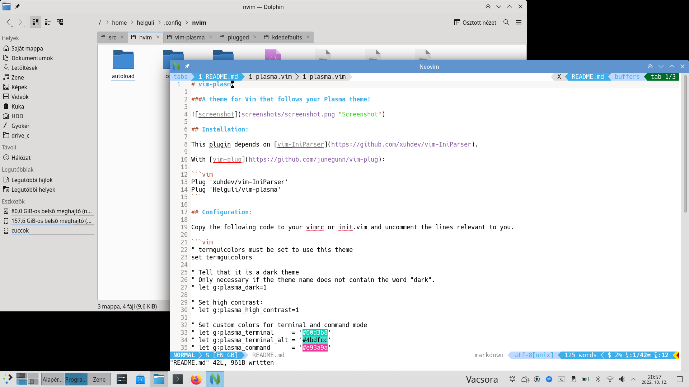
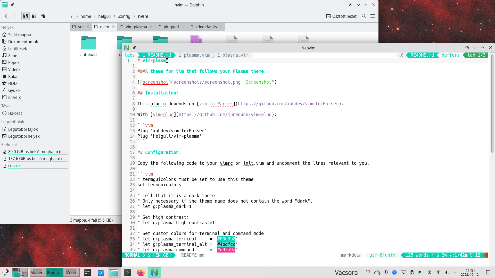
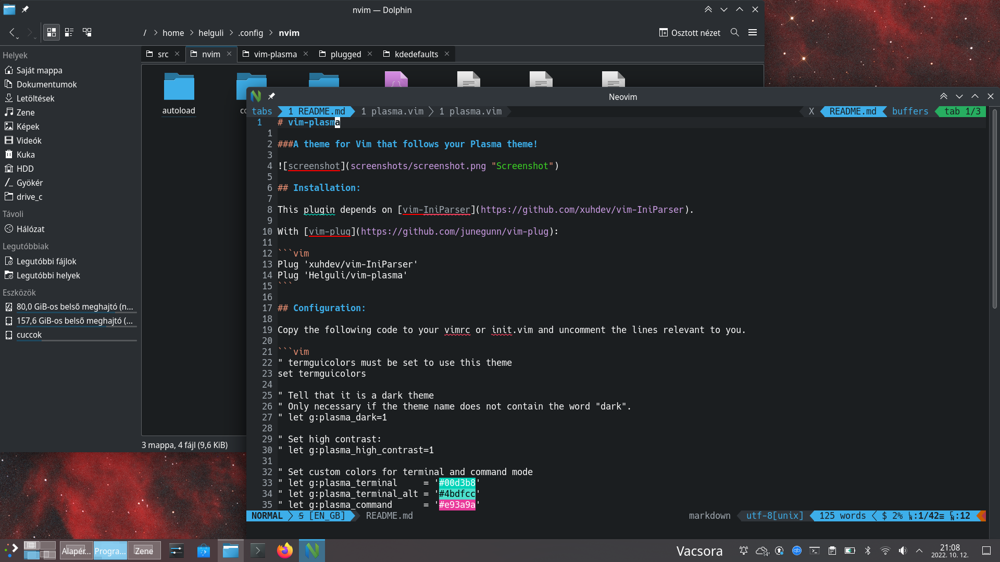

# vim-plasma

### A colorscheme for Vim that follows your Plasma theme!

Integrate Vim or Neovim into KDE with this plugin.  
See the screenshots below.







## Installation:

This plugin depends on [vim-IniParser](https://github.com/xuhdev/vim-IniParser).

### With [vim-plug](https://github.com/junegunn/vim-plug):

Put the following lines between `plug#begin` and `plug#end`.

```vim
Plug 'xuhdev/vim-IniParser'
Plug 'Helguli/vim-plasma'
```

## Configuration:

Copy the following code to your `.vimrc` or `init.vim` and uncomment the lines relevant to you.

```vim
" termguicolors must be set to use this theme
set termguicolors

" Tell that it is a dark theme
" Only necessary if the theme name does not contain the word "dark".
" let g:plasma_dark=1

" Set high contrast:
" let g:plasma_high_contrast=1

" Set custom colors for terminal and command mode
" let g:plasma_terminal     = '#00d3b8'
" let g:plasma_terminal_alt = '#4bdfcc'
" let g:plasma_command      = '#e93a9a'
" let g:plasma_command_alt  = '#ee74b7'

" Set the colorscheme:
colorscheme plasma
```

